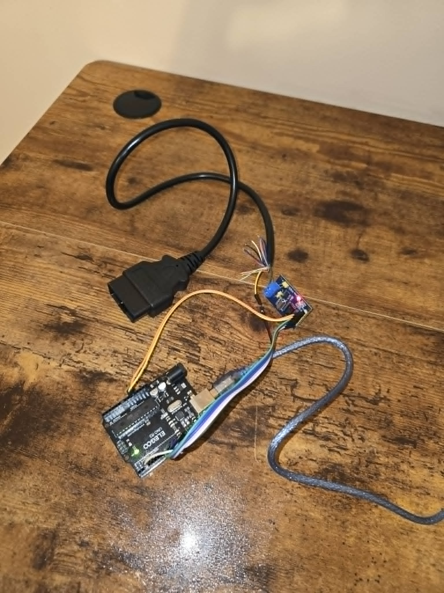

# Automotive CAN Bus Logger and Signal Analysis

A personal automotive electronics project for capturing CAN frames through an Uno-compatible board, recording them with Python, isolating selected arbitration IDs, and displaying observed vehicle states.



## Hardware connections

The following table documents the reconstructed connections between the Arduino Uno-compatible board and MCP2515 CAN module used for the project.

| Arduino Uno pin | MCP2515 module pin | Function |
| --- | --- | --- |
| 5V | VCC | Module power |
| GND | GND | Common ground |
| D10 | CS | SPI chip select |
| D11 | SI | SPI MOSI |
| D12 | SO | SPI MISO |
| D13 | SCK | SPI clock |
| D2 | INT | CAN controller interrupt |

### Vehicle CAN connection

| MCP2515 terminal | OBD-II pin | Function |
| --- | --- | --- |
| CAN-H | Pin 6 | CAN High |
| CAN-L | Pin 14 | CAN Low |

> **Note:** This pinout is a reconstruction based on the surviving hardware setup and standard Arduino Uno SPI assignments. The original acquisition sketch is unavailable, so the chip-select and interrupt assignments cannot be independently confirmed from firmware.

## Project overview

```text
Vehicle CAN
    ↓
OBD-II connection
    ↓
CAN controller/transceiver module
    ↓
ELEGOO Uno R3-compatible board
    ↓ USB serial
Python tools
    ├── Timestamped CSV logging
    ├── CAN-ID filtering
    ├── RPM display
    └── RPM / brake / lights dashboard
```

The Python programs expect the acquisition board to send one record per line:

```text
arduino_ms,can_id,data
```

Example:

```text
61,1F9,20 00 16 C1 00 00 00 00
```

## What this project demonstrates

- Serial ingestion of CAN records produced by an embedded acquisition interface
- Computer and board timestamps stored in CSV format
- Filtering traffic by CAN arbitration ID
- Byte-level payload inspection during controlled vehicle conditions
- Interpretation of an observed multi-byte engine-speed field
- Terminal display of interpreted RPM, brake, and exterior-light states
- Preservation of real test captures for comparison and validation

## Repository contents

```text
automotive-can-analysis/
├── README.md
├── LICENSE
├── requirements.txt
├── hardware_setup.jpg
├── can_csv_logger.py
├── can_id_monitor.py
├── specific_action_monitor.py
├── live_rpm.py
├── live_dashboard.py
└── maxima_dashboard_excerpt.csv
```

## Python tools

| Program | Purpose |
| --- | --- |
| [`can_csv_logger.py`](can_csv_logger.py) | Adds a computer timestamp and records incoming serial CAN data to a timestamped CSV file. |
| [`can_id_monitor.py`](can_id_monitor.py) | Prints payloads for one selected CAN ID for focused observation. |
| [`specific_action_monitor.py`](specific_action_monitor.py) | Prints the board timestamp, CAN ID, and payload for a selected ID. |
| [`live_rpm.py`](live_rpm.py) | Displays the observed RPM value at CAN ID `0x1F9`, using payload bytes 2–3 and the saved `raw / 8` rule. |
| [`live_dashboard.py`](live_dashboard.py) | Displays the latest RPM, brake, and exterior-light interpretations encoded during the project. |

## Setup

Requirements:

- Python 3.8 or newer
- A serial-connected acquisition board producing the expected record format
- The `pyserial` package

Create and activate a virtual environment on Windows, then install the dependency:

```shell
python -m venv .venv
.venv\Scripts\activate
pip install -r requirements.txt
```

Before running a program, update `SERIAL_PORT` near the top of the file if the board is not connected as `COM3`.

Run the CSV logger:

```shell
python can_csv_logger.py
```

Run the live dashboard:

```shell
python live_dashboard.py
```

Press Ctrl+C to stop either program.

## Observed signal interpretations

The surviving dashboard code contains the following project observations for a 2010 Nissan Maxima capture:

| CAN ID | Payload field | Interpretation used by the program |
| --- | --- | --- |
| `0x1F9` | Bytes 2–3, big-endian | `RPM = raw / 8` |
| `0x354` | Byte 6 | `0x14` = brake on; `0x04` = brake off |
| `0x625` | Byte 1 | `0x00` = off; `0x40` = DRL; `0x60` = low beam; `0x70` = high beam |

These mappings are experimental observations encoded in the surviving programs. They are not manufacturer documentation, a complete DBC, or a claim that the same definitions apply to another model or year.

## Sample data

[`maxima_dashboard_excerpt.csv`](maxima_dashboard_excerpt.csv) contains 18 genuine rows selected from the saved engine-on/revving capture: six rows each for CAN IDs `0x1F9`, `0x354`, and `0x625`. The rows are grouped by CAN ID and are therefore not in chronological order.

For example, the first RPM frame contains bytes `16 C1` at payload positions 2–3:

```text
raw = 0x16C1 = 5825
RPM = 5825 / 8 = 728.125
displayed RPM = 728
```

The full vehicle captures are intentionally excluded. The included excerpt demonstrates the logger format and dashboard input without publishing the complete datasets.

## Project history and limitations

The embedded acquisition sketch originally uploaded to the board is no longer available. This repository therefore documents and publishes the surviving Python logging and analysis tools only. It does not recreate the missing sketch or claim authorship of firmware that cannot be verified.

The photographs confirm the physical bench assembly, but the surviving artifacts do not independently establish the acquisition firmware's CAN bitrate, oscillator setting, library, or operating mode. Those details are intentionally left unspecified.

The included Python programs consume serial data; they do not transmit CAN frames.

## Safety and responsible use

Work on vehicle networks can affect vehicle operation. Use appropriate isolation and protection, prefer passive observation, and do not experiment on public roads. Do not publish employer, customer, proprietary, security-sensitive, or personally identifying vehicle data.

## Future improvements

- Accept the serial port and target CAN ID as command-line options
- Validate malformed hexadecimal payloads without interrupting a session
- Add automated tests using recorded or simulated serial input
- Plot changing signals over time
- Record confirmed observations in a small DBC or signal-definition file
- Rebuild and document an independently authored acquisition firmware component

## License

Released under the MIT License. See [`LICENSE`](LICENSE).
